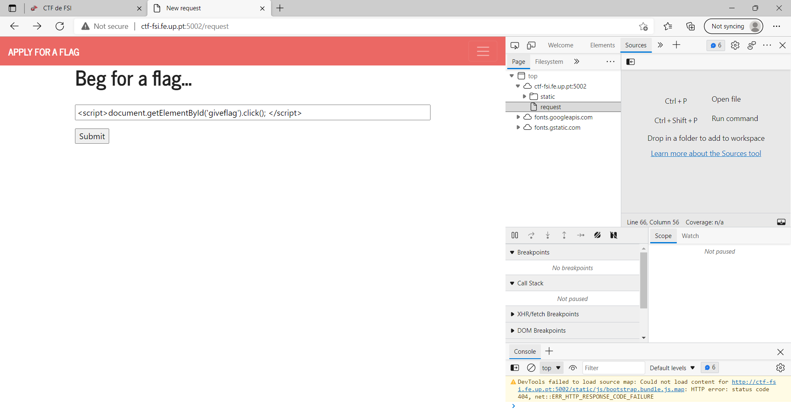
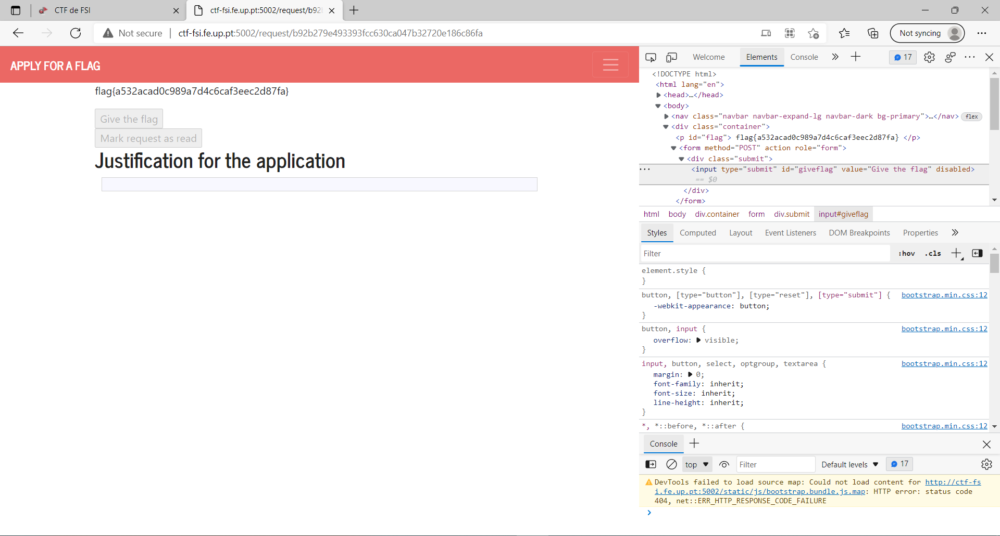

# Trabalho realizado na Semana #10

## Task 1 - Posting a Malicious Message to Display an Alert Window

## Task 2 - Posting a Malicious Message to Display Cookies

## Task 3: Stealing Cookies from the Victim’s Machine

## Task 4 - Becoming the Victim’s Friend

### Question 1

> Explain the purpose of Lines ➀ and ➁, why are they are needed?

As linhas 1 e 2 são necessárias, pois os campos `__elgg_ts` e `__elgg_token` são usados pelo servidor para identificar o utilizador a realizar o pedido.

### Question 2

> If the Elgg application only provide the Editor mode for the "About Me" field, i.e., you cannot switch to the Text mode, can you still launch a successful attack?

Não, pois o texto inserido é *encoded*, não sendo interpretado como código (por exemplo, o caratér `<` é substituído por `&gt;`)

--- 

# CTF realizado na Semana #10

## Desafio 1

A input de pedir para ser admin não é *sanitized*. Temos o *id* do botão de pedir a flag, só não o podemos clicar. 

Sendo assim, utilizamos um código de Javascript para clicar no botão com esse *id*. Quando o admin recebe, dá-nos a flag imediatamente.

## Desafio 2

Este desafio consiste num *buffer overflow*, similar ao do da semana 5.

