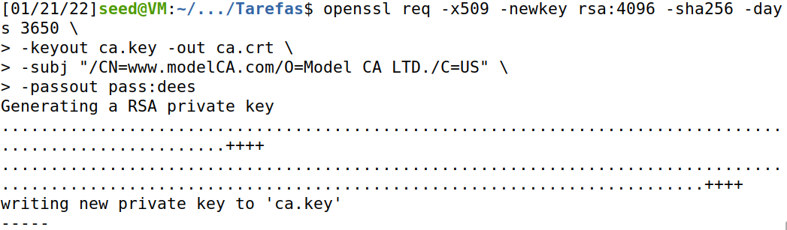
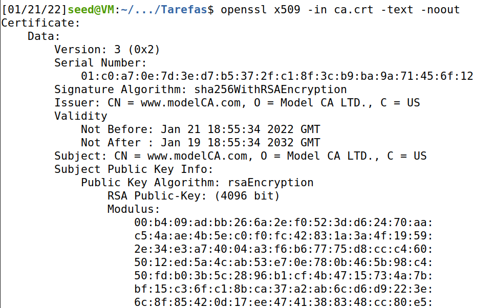
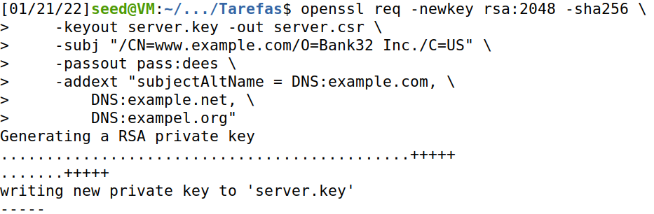
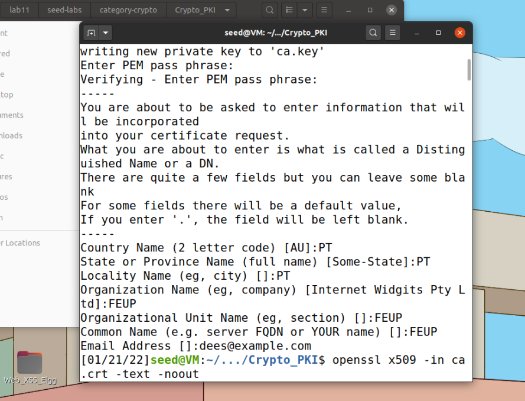

# Trabalho realizado na Semana #11 

# Task 1 - Becoming a Certificate Authority (CA)




> What part of the certificate indicates this is a CA’s certificate?

Because of the issuer.

> What part of the certificate indicates this is a self-signed certificate?

The issuer and the subject are the same.

> In the RSA algorithm, we have a public exponent e, a private exponent d, a modulus n, and two secret numbers p and q, such that n = pq. Please identify the values for these elements in your certificate and key files.

*e* - `publicExponent`  
*p* - `privateExponent`  
*n* - `modulus`  
*p* - `prime1`  
*q* - `prime2` 

```
modulus:
    00:b4:09:ad:bb:26:6a:2e:f0:52:3d:d6:24:70:aa:
    [...]
publicExponent: 65537 (0x10001)
privateExponent:
    00:a2:c7:c9:7b:d8:2c:d3:89:d8:62:2e:97:3e:03:
    [...]
prime1:
    00:e3:fa:0b:9f:62:75:42:1f:25:95:02:ee:db:b6:
    [...]
prime2:
    00:ca:2b:18:35:e4:0f:ce:6f:a4:09:b7:97:5f:b6:
    [...]
exponent1:
    2f:65:57:af:3e:2f:f4:9c:37:1b:00:ae:19:fd:89:
    [...]
exponent2:
    35:a0:48:c3:c2:c3:0e:97:3e:83:f5:57:09:e4:65:
    [...]
coefficient:
    00:c4:f7:ed:b3:80:d0:7f:fb:34:eb:b7:d8:25:73:
    [...]
```

# Task 2 - Generating a Certificate Request for Your Web Server



# Task 3 - Generating a Certificate for your server



# Task 4 - Deploying Certificate in an Apache-Based HTTPS Website

# Task 5 - Launching a Man-In-The-Middle Attack

# Task 6 - Launching a Man-In-The-Middle Attack with a Compromised CA


