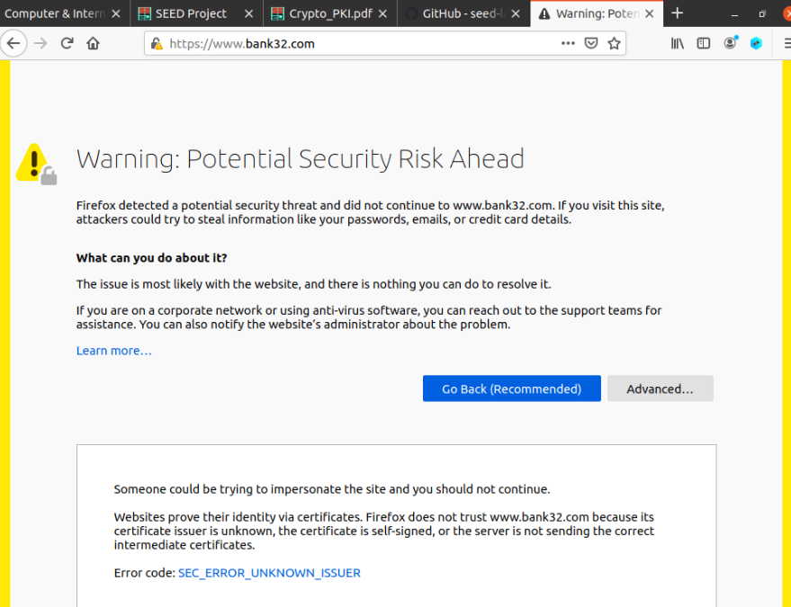

# Trabalho realizado na Semana #11 

# Task 1 - Becoming a Certificate Authority (CA)

CA's certificate: "CA:true"
Self signed: -x509
RSA:
Second command:
    -n: modulus
    -e: publicExponent
    -d: privateExponent
    -p: prime1
    -q: prime2

# Task 2 - Generating a Certificate Request for Your Web Server

3.2
Everything was successful, except that the aliasses would be added successfully but then not appear. Thankfully, they were not needed for this lab.

# Task 3 - Generating a Certificate for your server

3.3 
The certificate was successfully generated. as expected

# Task 4 - Deploying Certificate in an Apache-Based HTTPS Website

3.4
At first, we weren't successful. We had to swap the certificate keys from the ones using www.bank32.com as the server name to www.example.com
We succeeded, however, the website was not considered safe. (because it wasn't added to firefox's list of certificates yet)
We weren't successful in making the website secure, unless we used the bank32 configuration from the docker container. When using that configuration, we had to use the certificate key we created, not the one inside the docker container. We most likely swapped the keys in place by accident. Since we did this correctly in 3.6, we decided not to retry.

# Task 5 - Launching a Man-In-The-Middle Attack

3.5
We do not have control over the CA, so the end user is warned about the website and blocked, unless they allow it anyways.

# Task 6 - Launching a Man-In-The-Middle Attack with a Compromised CA

3.6
The MITM attack was successful. We used www.facebook.com as the url

