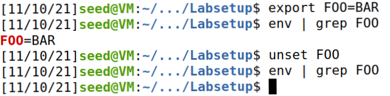
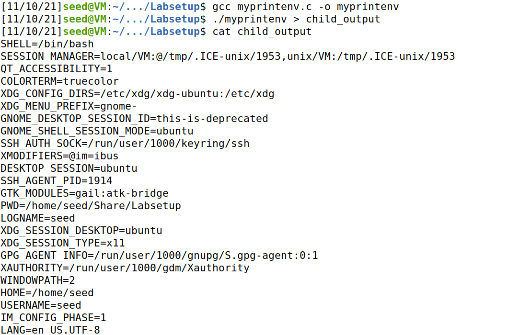
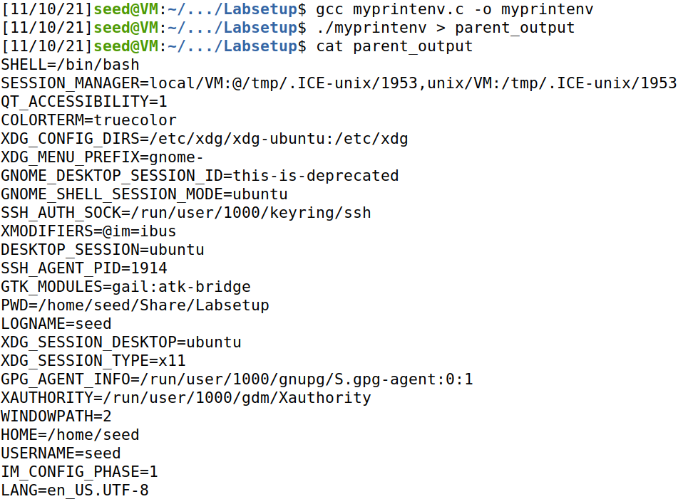
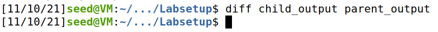
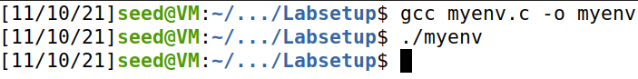
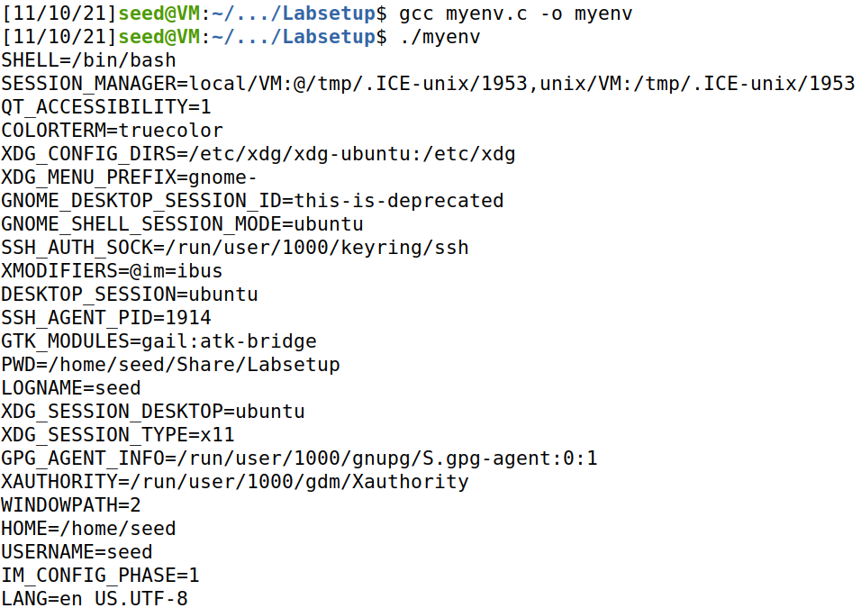
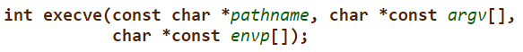
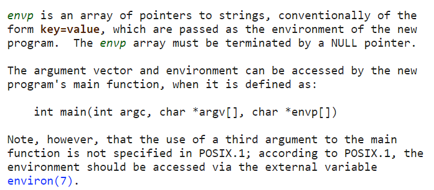
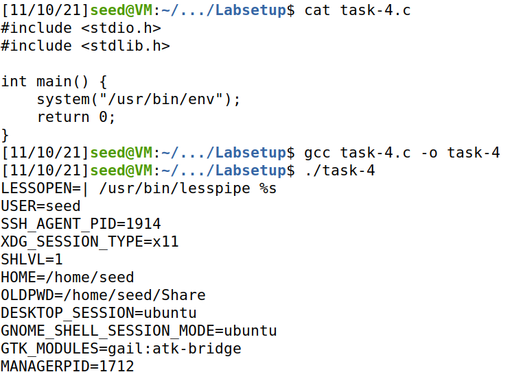

# Trabalho realizado na Semana #4

## Task 1: Manipulating Environment Variables



##  Task 2: Passing Environment Variables from Parent Process to Child Process

### Step 1

As variáveis de ambiente para o processo filho são *printed*.



### Step 2

As variáveis de ambiente para o processo pai são *printed*.



### Step 3

Usando o comando `diff` com o output de cada execução, é possível observar que não existem quaisquer diferenças, uma vez que as variáveis de ambiente são as mesmas para o processo pai e o processo filho.



## Task 3: Environment Variables and `execve()`

### Step 1

Nada é *printed*.



### Step 2

São *printed* as variáveis de ambiente.



### Step 3

O terceiro argumento da função `execve` é um *array* de *strings* que corresponde ao ambiente do novo programa (terceiro argumento da função `main` do mesmo).

Como no **Step 1**, este terceiro argumento é `NULL`, nenhumas variáveis de ambiente são encontradas, e, como tal, o *output* de `env` é vazio. 



No **Step 2**, substitui-se esse terceiro argumento pelas variáveis de ambiente do processo em questão, que se encontram na variável externa `environ`.



## Task 4: Environment Variables and `system()`



## Task 5: Environment Variable and Set-UID Programs


---

# CTF realizado na Semana #4

Depois de explorar o *source code* da página web, é possível obter a informação de que a versão do Wordpress a ser usada é a 5.8.2 e possui o plugin WooCommerce na versão 5.7.1.

```html
<meta name="generator" content="WordPress 5.8.2" />
<meta name="generator" content="WooCommerce 5.7.1" />
```

A partir daí, pesquisam-se por vulnerabilidades associadas.

Ao pesquisar na [Exploit Database](https://www.exploit-db.com/) pelos termos "Wordpress" e "WooCommerce", é possível encontrar uma [vulnerabilidade relacionada](https://www.exploit-db.com/exploits/50299) cujo exploit permite dar bypass ao processo de autenticação.

O exploit consiste adicionar `?wcj_user_id=` ao link do website e preencher com o ID 1 (que, por norma, será o ID do administrador).

Depois disso, será enviado um e-mail para o utilizador em questão com um token para validar a recuperação de password.

Esse token consiste numa hash MD5 do timestamp em que foi enviado o pedido, portanto facilmente se conclui o valor do token.

Usando-o, é possível entrar na conta do administrador e obter a flag.

