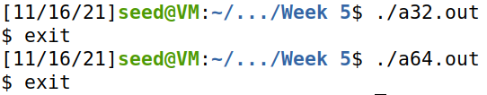
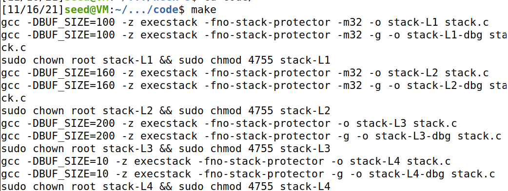
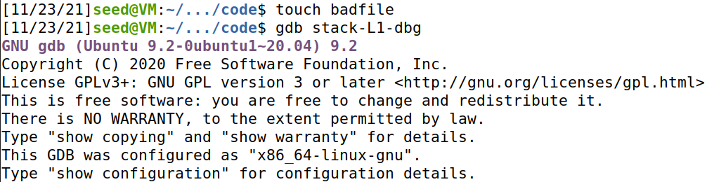
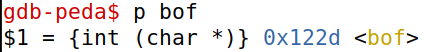
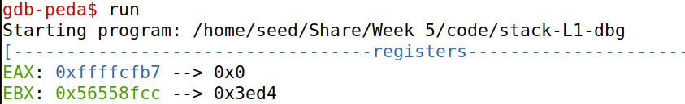
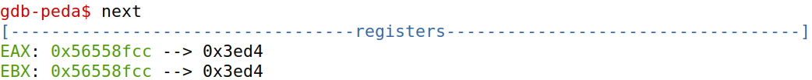
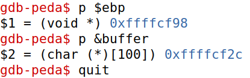

# Trabalho realizado na Semana #5

## Task 1: Getting Familiar with Shellcode



## Task 2: Understanding the Vulnerable Program



## Task 3: Launching Attack on 32-bit Program (Level 1)

### Investigation 

- Criar um ficheiro `badfile` vazio.



- Colocar um *break point* na função `bof()`.



- Começar a execução do programa.




- Obter o valor de `ebp`, o endereço do *buffer* e sair do *debugger*.



### Launching Attacks

Depois de realizar uma investigação preliminar, é necessário calcular, onde na *stack* deverá ser colocado o *shellcode* realizado, bem como o endereço de retorno a apontar para o nosso *shellode* a ser executado.

Estão alocados 517 bytes para o *buffer*, como tal, o ideal será colocar o fim do *shellcode*, no fim do *buffer*, assim temos que:

```py
start = 517 - len(shellcode)
```

Para o endereço de retorno, é necessário que este aponta para uma zona da stack de modo ao nosso *shellcode* ser executado.

Assim sendo, podemos colocar o código a retornar exatamente para o início do shellcode (era possível colocar em posições anteriores, uma vez que temos a prevenção dos NOP's).

```py
ret = 0xFFFFCF2C + start
```

Por fim, é necessário calcular o *offset* onde deverá ser colocado o endereço de retorno previamente calculado.

Para isso temos que `ebp = 0xFFFFCF98` e `buffer = 0xFFFFCF2C`. Efetuando a subtração entre os dois obtemos os valor 0x6C ou seja 112.

```py
offset = 112
```

# CTF realizado na Semana #5

## Desafio 1

Analisando o código-fonte do programa em questão, é possível observar que este lê um ficheiro identificado pela *string* `meme_file`.

Modificando o conteúdo dessa *string*, que por definição possui o valor `mem.txt\0`, é possível controlar o ficheiro que está a ser lido.

Para tal, existe a possibilidade de tomar proveito de um *buffer-overflow* presente no programa.

A *string* `buffer` possui 20 carateres alocados, no entanto, são lidos 28 carateres pelo `scanf`.

Os 8 carateres extra que escrevermos serão inseridos na *string* `meme_file`.

Portanto, basta escrever no terminal 20 carateres (bytes) quaisquer e no final acrescentar "flag.txt", para o conteúdo de `meme_file` ser alterado e o ficheiro a ser lido ser o que contém a *flag*.

## Desafio 2

Na nova versão do código, foi acrescentada uma verificação extra para dificultar a tarefa de ler o ficheiro, no entanto, esta não mitiga por completa o problema, uma vez que continua a ser possível contorná-la usando uma técnica semelhante à do desafio anterior.

A verificação em questão é a seguinte:

```c
*(long*) val == 0xfefc2122
```

Ou seja, o valor de `val` (que é um `char*`) é convertido para um `long*` e é lido o conteúdo desse endereço ao desreferenciá-lo. Como o endereço passou a apontar para um `long` o conteúdo do mesmo vai ser interpretado como um número inteiro. Caso não houvesse essa conversão, apenas seria lido o byte menos significativo, uma vez que `char` apenas contém um byte e `long` contém quatro.

Um *buffer overflow* continua presente, portanto é possível alterar o conteúdo tanto de `val` como de `meme_file`, uma vez que estão ser lidos 32 bytes e `buffer` apenas possui 20.

O conteúdo de `flag` tem de ser `0xfefc2122` para ser ultrapassada a verificação, no entanto, não é possível simplesmente inserir esse número no *input* uma vez que o programa interpreta que estão a ser inseridos carateres.

Como tal, é necessário escrever carateres cuja representação em hexadecimal correspondente à desejada.

Dividindo `0xfefc2122` em carateres (bytes) ficamos com `0xfe 0xfc 0x21 0x22`.

Para inserir os dois primeiros carateres correspondentes é simples, uma vez que `0x21` corresponde a `"` e `0x22` corresponde a `!` em ASCII/UTF-8 . 

No entanto, em ASCII, o bit mais significativo possui sempre o valor 0, o que não se verifica com `0xfe` e `0xfc`. Por outro lado, UTF-8 usa esse bit para indicar se o carater a ser representado usa mais do que um byte (caso o valor desse bit seja um) e não existe nenhum carater em UTF-8 que use dois bytes e cujo valor seja `0xfe 0xfc`.

Portanto, existe a alternativa de UTF-16, que usa dois bytes para representar cada carater. Assim, basta obter o caratér representado por `0x21 0x22` (`™`) e o caratér representado por `0xfe 0xfc` (`ﻼ`).

Para executar o *exploit*, basta-nos então introduzir 10 carateres quaisquer (para perfazer os 20 bytes do `buffer`), depois acrescentar `™ﻼ` (para ultrapassar a verificação) e por fim acrescentar `flag.txt` para ser lido o ficheiro que contém a *flag*.

No entanto, em UTF-16, "flag.txt" ocupa 16 bytes, ultrapassando os 8 reservados. 

O *workaround* projetado foi colocar o input inicial num ficheiro codificado em UTF-16 e "flag.txt" num ficheiro ASCII/UTF-8, concatená-los e redirecionar o *output* para o *input* do programa atráves de um `pipe`.


