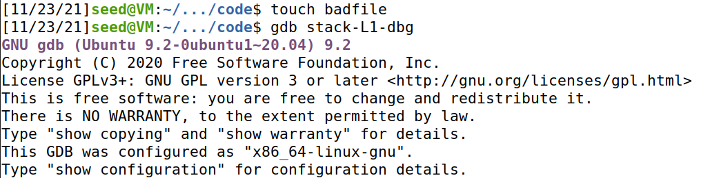
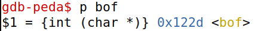
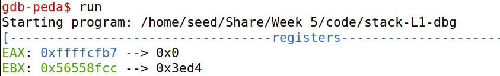
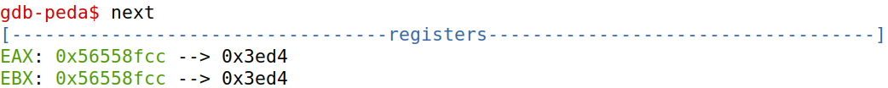
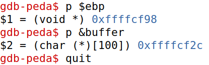

# Trabalho realizado na Semana #5

## Task 1: Getting Familiar with Shellcode


## Task 2: Understanding the Vulnerable Program


## Task 3: Launching Attack on 32-bit Program (Level 1)

### Investigation 

- Criar um ficheiro `badfile` vazio.



- Colocar um *break point* na função `bof()`.



- Começar a execução do programa.




- Obter o valor de `ebp`, o endereço do *buffer* e sair do *debugger*.



### Launching Attacks

Depois de realizar uma investigação preliminar, é necessário calcular, onde na *stack* deverá ser colocado o *shellcode* realizado, bem como o endereço de retorno a apontar para o nosso *shellode* a ser executado.

Estão alocados 517 bytes para o *buffer*, como tal, o ideal será colocar o fim do *shellcode*, no fim do *buffer*, assim temos que:

```py
start = 517 - len(shellcode)
```

Para o endereço de retorno, é necessário que este aponta para uma zona da stack de modo ao nosso *shellcode* ser executado.

Assim sendo, podemos colocar o código a retornar exatamente para o início do shellcode (era possível colocar em posições anteriores, uma vez que temos a prevenção dos NOP's).

```py
ret = 0xFFFFCF2C + start
```

Por fim, é necessário calcular o *offset* onde deverá ser colocado o endereço de retorno previamente calculado.

Para isso temos que `ebp = 0xFFFFCF98` e `buffer = 0xFFFFCF2C`. Efetuando a subtração entre os dois obtemos os valor 0x6C ou seja 112.

```py
offset = 112
```
