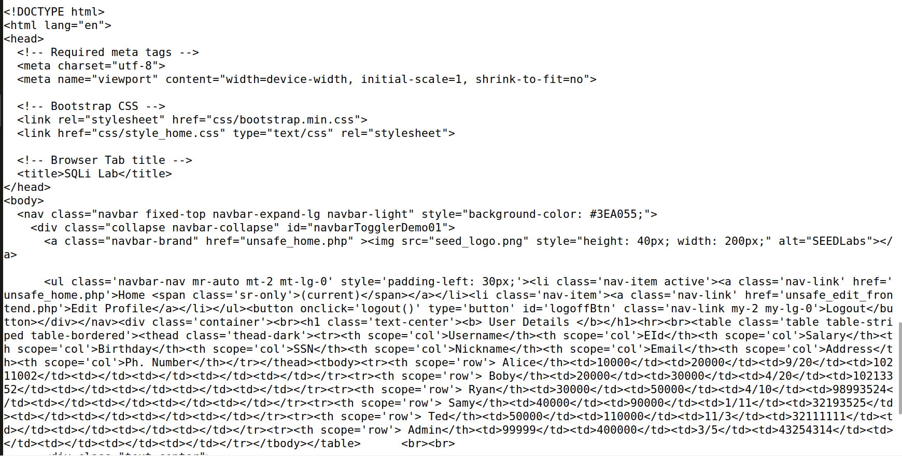
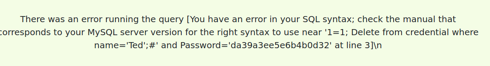
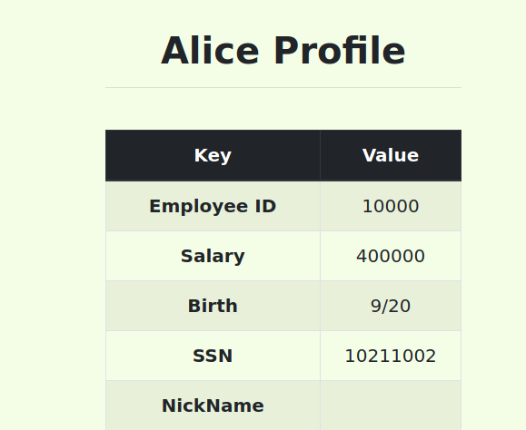
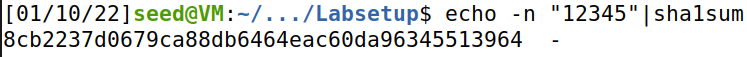
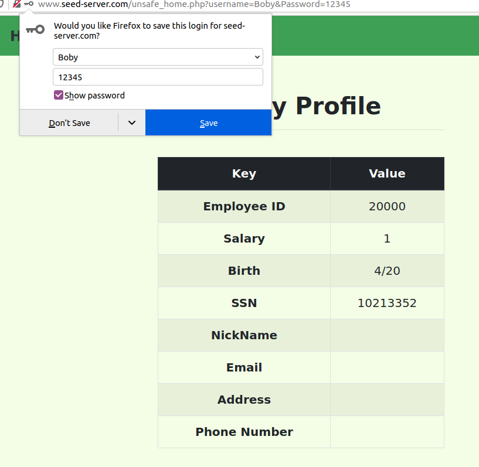

# Trabalho realizado na semana 8

## Task 1 - Get Familiar with SQL Statements

## Task 2 - SQL Injection Attack on SELECT Statement

### Task 2.1 - SQL Injection Attack from webpage

### Task 2.2 - SQL Injection Attack from command line

Podemos obter toda a informação dos utilizadores correndo o comando curl apresentado, que nos retorna no terminal a seguinte informação em formato html.

### Task 2.3 - Append a new SQL statement
Podemos tentar correr duas queries correndo a seguinte instrução ao tentar fazer login.
' 1=1; Delete from credential where name='Ted';#

Como é possível observar existe uma contramedida que nos impede de executar duas queries de uma só vez. 
Isto acontece pois a função mysql_query() propositadamente não suporta multiplas queries.

## Task 3: SQL Injection Attack on UPDATE Statement
### Task 3.1 - Modify your own salary

Podemos alterar o nosso próprio salario aproveitando-nos desta vulnerabilidade introduzindo a seguinte expressão num campo ao editar o nosso perfil
', salary=400000 where EID=10000;#
### Task 3.2 -  Modify other people’ salary
À semelhança da tarefa anterior podemos repetir o processo mas selecionar antes o nome 'Boby'. Também usar o EID já que temos acesso à toda a informação.

', salary=1 where name='Boby';#

### Task 3.3 - Modify other people’ password
Para alterar a password, não basta alterar o campo password. Em vez disso temos que gerar a hash sha1sum da password desejada e introduzir esse valor. Podemos obter a chave num terminal fazendo o seguinte comando:

De seguida basta introduzir a seguinte expressão num campo ao editar o nosso perfil.
', password="8cb2237d0679ca88db6464eac60da96345513964" where name ='Boby';#

---
# CTF

`admin' --`

## Desafio 2

