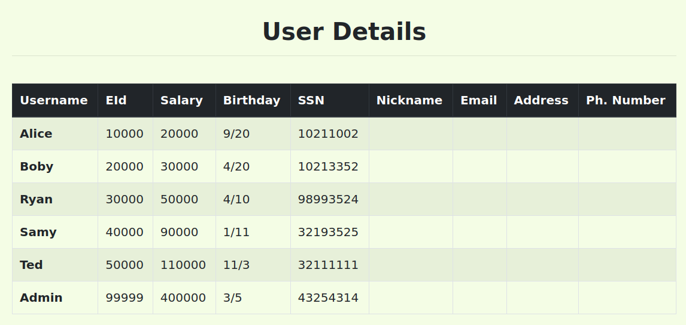

# Trabalho realizado na semana 8

## Task 1 - Get Familiar with SQL Statements

## Task 2 - SQL Injection Attack on SELECT Statement

### Task 2.1 - SQL Injection Attack from webpage

### Task 2.2 - SQL Injection Attack from command line

We can then observe the information of all users since the curl command returns in the terminal the following html text that has all the information on it.

Inserir imagem aqui

### Task 2.3 - Append a new SQL statement
' 1=1; Delete from credential where name='Ted';#
Inserir imagem aqui

Como é possível observar existe uma contramedida que nos impede de executar duas queries de uma só vez. 
Isto acontece pois a função mysql_query() propositadamente não suporta multiplas queries.

## Task 3: SQL Injection Attack on UPDATE Statement
### Task 3.1 - Modify your own salary
Inserir imagem aqui
Podemos alterar o nosso próprio salario aproveitando-nos desta vulnerabilidade introduzindo a seguinte expressão num campo ao editar o nosso perfil
', salary=400000 where EID=10000;#
### Task 3.2 -  Modify other people’ salary
À semelhança da tarefa anterior podemos repetir o processo mas selecionar antes o nome 'Boby'. Também usar o EID já que temos acesso à toda a informação.

', salary=1 where name='Boby';#
Inserir imagem aqui

### Task 3.3 - Modify other people’ password
Para alterar a password, não basta alterar o campo password. Em vez disso temos que gerar a hash sha1sum da password desejada e introduzir esse valor. Podemos obter a chave num terminal fazendo o seguinte comando:

De seguida basta introduzir a seguinte expressão num campo ao editar o nosso perfil.
', password="8cb2237d0679ca88db6464eac60da96345513964" where name ='Boby';#

---
# CTF

`admin' --`

## Desafio 2

